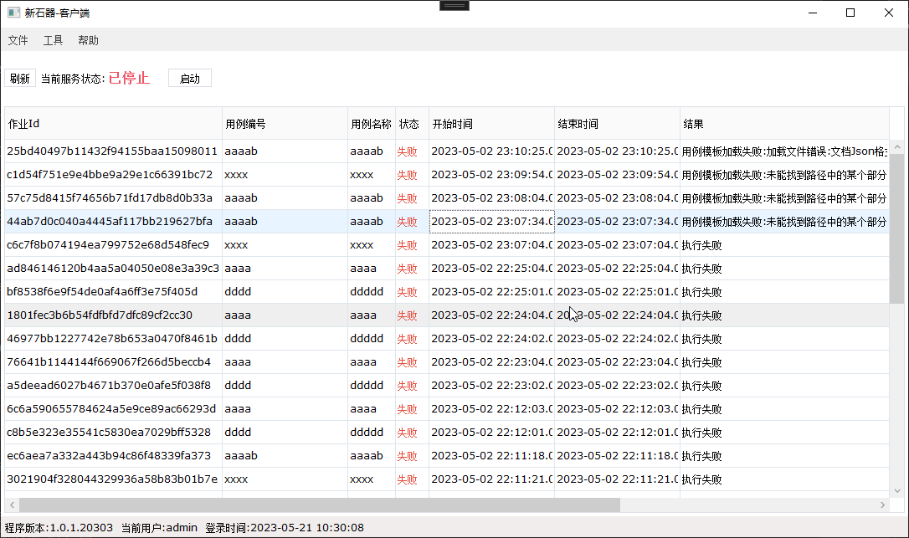

## SmartUI.Admin
 新石器是一款功能强大、简单易用、0编程的自动化测试系统，并提供在开发、集成、部署、运行和维护过程中一整套专业的自动化测试解决方案。
它借鉴了市场上主流的自动化软件的优点，采用设计器、执行器和控制器“三合一”的架构模式。提供包括脚本录制、开发、编写、调试；测试用例与测试计划的制定、执行；用例运行结果及日志的汇总、分析，自动生成各种维度的测试报告等功能。
帮助企业解决日常测试管理过程中遇到的资产管理、测试效率、测试质量的问题，降低企业研发成本，提高产品质量，助力企业实现数字化、智能化升级转型。  

注：此系统基于[YiShaAdmin](https://github.com/liukuo362573/YiShaAdmin)实现，除了修复众多的bug之后，还增加了很多额外的功能，如打包、安装；角色分类；api接口及用户token等等。另外也很感谢YiShaAdmin的作者对开源做出的贡献。

## 在线体验
- 地址：http://62.234.16.106/  
- 用户/密码：demo/123456

## 使用交流
- QQ 交流群：151492505

## 安装体验
1、新建一个mysql数据库  
2、修改appsettings.json（目录:src\YiSha.Web\YiSha.Admin.Web）中数据库相关配置  
3、运行，输入url地址 http://localhost/install/index，点击安装即可  
4、管理员：admin/123456 

## 部分截图

## 功能列表
### 测试相关功能
- 产品管理：用于管理需要测试的项目、产品
- 功能模块：设置各个项目中需要测试的功能及模块
- 运行环境：测试用例执行的环境，如开发、测试、预发、生产等环境
- 用例模板：管理在设计器中创建并发布到控制器的项目脚本和变量
- 测试用例：根据用例模板来创建不同的执行用例、设置每个用例的变量
- 测试计划：可根据实际的需要，创建不同的测试计划，配合Cron执行策略可自动创建测试任务并执行
- 任务执行记录：根据测试计划及Cron执行策略自动创建的任务。任务中包含需要执行的作业（即用例）
- 作业执行记录：任务执行记录中的包含的用于执行的具体用例。一个用例即为一个作业
- 客户端管理：当前所有的电脑及客户端，在创建测试计划的时候可以指定用例在哪个客户端上面执行

### 基础功能
- 员工管理：员工是系统操作者，该功能主要完成系统用户配置
- 部门管理：配置系统组织机构（公司、部门、小组）
- 职位管理：配置系统用户所担任职务
- 文章中心：管理新闻及公司案例
- 角色管理：角色菜单权限分配，角色对应权限，员工属于某个角色
- 菜单管理：配置系统菜单，操作权限，按钮权限标识
- 通用字典：系统里动态改变的数据，像文章类型，用字典进行维护，不变的数据，可以用枚举
- 行政区划：全国的省市县三级数据，展示树形数据的使用
- 系统日志（登录日志、操作日志、Api日志）：查看系统的登录、操作、Api调用日志
- 定时任务：在线（添加、修改、删除）任务调度，包含执行结果日志
- 系统Api：Api文档与测试工具

### 辅助功能
- 服务器信息：查看服务器的基本信息
- 数据表管理：查看当前数据库所有表、字段及记录总数
- 代码生成：快速生成对单表的增删改查
- 打包&安装：自动生成安装所需要的脚本，然后在部署的时候可直接安装

## License
[MIT](https://github.com/lilin0415/SmartUI.Admin/blob/master/LICENSE)  
